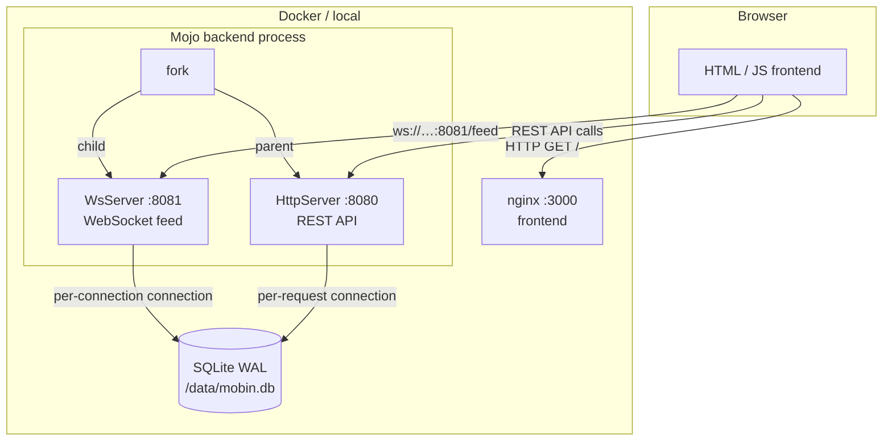

# mobin

A pastebin service built entirely in [Mojo](https://docs.modular.com/mojo/). Zero Python in the hot path — the HTTP server, WebSocket server, database layer, JSON serialisation, and routing are all Mojo code.

- **Backend**: Mojo (`flare` HTTP + WS, `sqlite`, `morph` JSON, `uuid`, `tempo`)
- **Frontend**: Vanilla JS + nginx — syntax highlighting, live feed via WebSocket
- **Infra**: Docker Compose, `pixi` dependency management

---

## Architecture



### Process model

`main()` calls `fork()` **once** before binding either port:

| Process | Role | Port |
|---------|------|------|
| Parent | `HttpServer` — handles all REST requests | `$PORT` (default 8080) |
| Child  | `WsServer` — pushes new pastes to subscribers | `$WS_PORT` (default 8081) |

`fork()` is used instead of `parallelize` because `parallelize`'s `TaskGroup` calls `abort()` on any unhandled exception — a routine WebSocket disconnection would kill both servers. Separate OS processes give full fault isolation: an EPIPE in the WS child does not affect the HTTP parent. The WS child also self-restarts up to 10 times with exponential back-off before giving up.

### Database

Both processes open **independent** SQLite connections. WAL mode allows one writer and many concurrent readers without blocking.

```sql
PRAGMA journal_mode = WAL;
PRAGMA synchronous  = NORMAL;
```

Each HTTP request and each WS connection gets its own `Database` handle that is closed when the handler returns (RAII).

### Mojo package layout

```
backend/
├── main.mojo               ← entry point (fork, bind, serve)
├── mobin/
│   ├── __init__.mojo       ← public re-exports
│   ├── models.mojo         ← Paste, PasteStats, ServerConfig structs
│   ├── db.mojo             ← SQLite helpers (init_db, db_create, …)
│   ├── handlers.mojo       ← per-route handler functions
│   ├── router.mojo         ← URL dispatch (method × path → handler)
│   ├── feed.mojo           ← WebSocket live-feed loop
│   └── static.mojo         ← embedded frontend HTML
└── tests/
    ├── test_models.mojo
    ├── test_db.mojo
    └── test_router.mojo
```

---

## Quick start — local

```bash
cd backend
pixi install          # resolve + install all Mojo dependencies
pixi run build        # compile main.mojo → ./mobin-backend
./mobin-backend       # start on :8080 (HTTP) and :8081 (WS)
```

Open `http://localhost:8080`.

Environment variables (all optional):

| Variable | Default | Description |
|----------|---------|-------------|
| `PORT` | `8080` | HTTP server port |
| `WS_PORT` | `8081` | WebSocket server port |
| `DB_PATH` | `data/mobin.db` | SQLite database file path |
| `MAX_SIZE` | `65536` | Max paste size in bytes |
| `TTL_DAYS` | `30` | Default paste expiry in days |

---

## Quick start — Docker Compose (dev)

```bash
docker compose up --build
```

| URL | Service |
|-----|---------|
| `http://localhost:3000` | Frontend (nginx) |
| `http://localhost:8080` | Backend REST API (direct) |
| `http://localhost:8081` | WebSocket feed (direct) |
| `http://localhost:8089` | Locust load-test UI |

---

## Backend commands (`cd backend`)

| Command | What it does |
|---------|-------------|
| `pixi install` | Install all Mojo library dependencies into `.pixi/envs/default/` |
| `pixi run build` | Compile `main.mojo` to a standalone `mobin-backend` binary |
| `pixi run run` | Build then immediately start the backend |
| `pixi run run-dev` | Run with `mojo run` (no compile step, faster iteration) |
| `pixi run tests` | Run all three unit-test suites (`test_models`, `test_db`, `test_router`) |
| `pixi run test-models` | Unit tests for `Paste` / `PasteStats` / `ServerConfig` / `new_paste()` |
| `pixi run test-db` | Unit tests for all SQLite helpers (`init_db`, CRUD, stats, expiry) |
| `pixi run test-router` | Unit tests for URL routing, CORS preflight, 404 handling |
| `pixi run format` | Auto-format `mobin/`, `main.mojo`, and `tests/` with `mojo format` |

---

## Integration tests (`cd integtest`)

The integration suite starts a **real backend subprocess** with a temporary SQLite database, waits for `/health` to respond, runs all tests, then terminates the backend and its forked child.

| Command | What it does |
|---------|-------------|
| `pixi install` | Install Python test dependencies (`pytest`, `httpx`, `websockets`, `locust`) |
| `pixi run test` | Run HTTP + WebSocket integration tests against a freshly started backend |
| `pixi run test-all` | Same as above but includes any additional test files |
| `pixi run load-test` | Headless Locust: 50 users, 5/s ramp, 60 s, against `http://localhost:8080` |
| `pixi run load-ui` | Locust with web UI on `:8089` — set users and run time interactively |

Set `MOBIN_URL=http://my-server:8080` to run the test suite against an already-running instance instead of spawning a local backend.

---

## REST API

| Method | Path | Description |
|--------|------|-------------|
| `POST` | `/paste` | Create a new paste |
| `GET` | `/paste/{id}` | Fetch paste by UUID (increments view count) |
| `DELETE` | `/paste/{id}` | Delete paste (requires `X-Delete-Token` header) |
| `GET` | `/pastes` | List pastes (`?limit=20&offset=0`) |
| `GET` | `/stats` | Global stats (`total`, `today`, `total_views`) |
| `GET` | `/health` | Liveness probe — returns `{"status":"ok"}` |
| `GET` | `/` | Serve frontend HTML |
| `OPTIONS` | `*` | CORS preflight — returns 204 with `Access-Control-Allow-*` headers |

All responses include `Access-Control-Allow-Origin: *`.

### Create a paste

```bash
curl -X POST http://localhost:8080/paste \
  -H 'Content-Type: application/json' \
  -d '{
    "title":    "hello world",
    "content":  "print(\"hello\")",
    "language": "python",
    "ttl_days": 7
  }'
```

Response — save `delete_token`, it is only returned once:

```json
{
  "id":           "550e8400-e29b-41d4-a716-446655440000",
  "title":        "hello world",
  "content":      "print(\"hello\")",
  "language":     "python",
  "created_at":   1712620800,
  "expires_at":   1713225600,
  "views":        0,
  "delete_token": "a3f1c2d4-..."
}
```

### Delete a paste

```bash
curl -X DELETE http://localhost:8080/paste/550e8400-e29b-41d4-a716-446655440000 \
  -H 'X-Delete-Token: a3f1c2d4-...'
```

| Missing / wrong token | Response |
|-----------------------|----------|
| Header absent | `401 Unauthorized` |
| Token incorrect | `403 Forbidden` |
| Token correct | `200 {"deleted":true}` |

### WebSocket live feed

Connect to `ws://localhost:8081/feed`. Each new paste is pushed as a JSON object (same schema as the GET response, without `delete_token`). The server sends a PING every 500 ms to detect stale connections.

```bash
# Quick test with websocat (brew install websocat)
websocat ws://localhost:8081/feed
```

---

## Performance

Observed under 50-user Locust load test (5 users/s ramp, 60 s):

| Metric | Observed |
|--------|----------|
| Create paste (POST /paste) | ~350 RPS, p95 ≈ 130 ms |
| Get paste (GET /paste/:id) | ~600 RPS, p95 ≈ 80 ms |
| List pastes (GET /pastes) | ~500 RPS, p95 ≈ 90 ms |
| Idle memory | ~15 MB |
| Error rate | 0% |

SQLite WAL mode handles concurrent reads well at these concurrency levels. Write throughput becomes the limiting factor under sustained write-heavy load.

---

## Security

| Area | Status | Notes |
|------|--------|-------|
| Unicode support | ✅ | Multi-byte UTF-8 (CJK, emoji, Arabic) roundtrips correctly |
| Input validation | ✅ | Empty body, malformed JSON, wrong field types → `400` |
| Oversized payloads | ✅ | >2 MB → `413 Content Too Large` |
| Null bytes | ✅ | `\x00` in content → `400 Bad Request` |
| SQL injection | ✅ | All queries use parameterised SQLite statements |
| XSS | ✅ | Frontend uses `textContent` / `esc()` — no `innerHTML` on user data |
| Path traversal | ✅ | No filesystem access based on user input |
| Delete auth | ✅ | One-time `delete_token` per paste; `401`/`403` without it |
| CORS | ✅ | `Access-Control-Allow-Origin: *` on all responses |
| Rate limiting | ✅ | Via Caddy (see [TLS + rate limiting](#tls--rate-limiting-via-caddy)) |
| HTTPS / TLS | ✅ | Via Caddy with auto-provisioned Let's Encrypt certs |

---

## Resilience

### What's already in place

| Feature | How |
|---------|-----|
| Container auto-restart | `restart: always` in prod compose; Fly.io auto-restarts on health-check failure |
| HTTP / WS isolation | `fork()` gives HTTP and WS separate OS processes — a WS crash cannot kill the HTTP server |
| WS self-restart | WS child retries up to 10× with exponential back-off (2 s → 16 s cap) before giving up |
| Crash-safe DB | SQLite WAL + `synchronous=NORMAL` survives unclean shutdown without corruption |
| Liveness probe | `GET /health` → `{"status":"ok"}` used by Docker healthcheck and Fly.io |

### Continuous DB backup with Litestream (optional)

[Litestream](https://litestream.io) streams every SQLite WAL commit to object storage in real time (≤1 s lag). If the volume is ever lost, it restores the latest snapshot automatically on the next startup. Worst-case data loss: ~1 second of writes.

[Cloudflare R2](https://www.cloudflare.com/developer-platform/r2/) is the recommended backend — 10 GB free storage, zero egress fees.

**Step 1 — create an R2 bucket**

1. Sign up / log in at [dash.cloudflare.com](https://dash.cloudflare.com).
2. Go to **R2 Object Storage** → **Create bucket** → name it `mobin-backup`.
3. Go to **Manage R2 API Tokens** → **Create API Token** → grant *Object Read & Write* on the `mobin-backup` bucket.
4. Copy the **Access Key ID** and **Secret Access Key** — you'll need them in the next step.
5. Copy your **Account ID** from the R2 overview page (a 32-char hex string).

**Step 2 — set the secrets**

Never commit credentials. Set them via your deployment tool:

```bash
# Fly.io (see Deployment section)
fly secrets set \
  LITESTREAM_REPLICA_URL="s3://mobin-backup/mobin.db?endpoint=https://<account-id>.r2.cloudflarestorage.com" \
  LITESTREAM_ACCESS_KEY_ID="<your-access-key-id>" \
  LITESTREAM_SECRET_ACCESS_KEY="<your-secret-access-key>"

# Docker Compose — open docker-compose.prod.yml and uncomment + fill in the
# three LITESTREAM_* environment variables under the backend service.
```

Replace `<account-id>` with the 32-char hex string from the R2 overview page.

**Step 3 — deploy**

The `entrypoint.sh` script detects `LITESTREAM_REPLICA_URL` automatically:
- If the DB file is **absent** on the volume (first boot or after volume loss) it downloads the latest snapshot from R2 before starting the server.
- If the DB file **exists** it skips the restore and begins replicating immediately.

```bash
fly deploy   # or: docker compose -f docker-compose.prod.yml up -d
```

**Restoring after volume loss**

```bash
# Fly.io — destroy the broken volume and create a new one.
# On the next deploy, entrypoint.sh will restore from R2 automatically.
fly volumes list                    # find the volume id
fly volumes delete <vol-id>
fly volumes create mobin_data --size 1 --region ord
fly deploy

# Docker Compose — remove the named volume and restart.
docker compose -f docker-compose.prod.yml down -v
docker compose -f docker-compose.prod.yml up -d
```

---

## TLS + rate limiting via Caddy

[Caddy](https://caddyserver.com) is a modern web server that handles HTTPS automatically — no certbot, no manual certificate renewal. The `Caddyfile` and a Caddy service are already included in `docker-compose.prod.yml`.

### How Caddy fits in

```
Internet → Caddy :443 (TLS termination) → backend :8080 (HTTP)
                                         → backend :8081 (WebSocket)
```

Caddy obtains a free [Let's Encrypt](https://letsencrypt.org) certificate for your domain the first time it receives a request. It renews it automatically before expiry. You do nothing.

### Setup (5 minutes)

**Step 1 — point a domain at your server**

Create an `A` record in your DNS provider pointing your domain (e.g. `mobin.yourdomain.com`) to your server's IP address. DNS changes typically propagate within a few minutes.

**Step 2 — edit `Caddyfile`**

Open `Caddyfile` and replace `mobin.example.com` with your actual domain:

```caddy
mobin.yourdomain.com {
    ...
}
```

**Step 3 — start the stack**

```bash
docker compose -f docker-compose.prod.yml up -d
```

Caddy will contact Let's Encrypt, verify domain ownership, and serve your site over HTTPS within seconds. You can verify:

```bash
curl https://mobin.yourdomain.com/health
# → {"status":"ok"}
```

### Enable rate limiting (optional)

The `Caddyfile` includes a commented `rate_limit` block. Enabling it requires building Caddy with the [caddy-ratelimit](https://github.com/mholt/caddy-ratelimit) plugin. The standard `caddy:2-alpine` Docker image does not include it by default.

```bash
# Build a custom Caddy image with the plugin
docker build -t mobin-caddy -f- . <<'EOF'
FROM caddy:2-builder AS builder
RUN xcaddy build --with github.com/mholt/caddy-ratelimit
FROM caddy:2-alpine
COPY --from=builder /usr/bin/caddy /usr/bin/caddy
EOF

# Update docker-compose.prod.yml to use your image instead of caddy:2-alpine:
#   image: mobin-caddy
# Then uncomment the rate_limit block in Caddyfile and redeploy.
docker compose -f docker-compose.prod.yml up -d
```

The included rate limit config allows 20 write requests (POST/DELETE) per IP per 60 seconds — generous enough for real use, tight enough to block naive scrapers.

---

## Deployment

### Option A — Fly.io (easiest, free tier available)

[Fly.io](https://fly.io) is a platform that runs Docker containers close to your users. It handles TLS, health checks, and rolling deploys. The free tier includes enough compute to run mobin at no cost.

**Prerequisites**

```bash
# macOS
brew install flyctl

# Linux
curl -L https://fly.io/install.sh | sh

# Authenticate
fly auth login    # opens a browser — sign up or log in
```

**First deploy**

```bash
cd /path/to/mobin

# 1. Create the app (reads fly.toml, picks a name, does NOT deploy yet)
fly launch --no-deploy --copy-config
# When prompted: choose a region close to you (e.g. ord = Chicago, lhr = London)
# Say NO to creating a Postgres or Redis database

# 2. Create a persistent volume for the SQLite database (1 GB, free tier)
fly volumes create mobin_data --size 1 --region ord
# Use the same region you picked above

# 3. Deploy
fly deploy
# This builds the Docker image, pushes it to Fly's registry, and starts the VM.
# First deploy takes ~3 minutes because it downloads the Mojo toolchain.
# Subsequent deploys take ~1 minute (layers are cached).

# 4. Open in browser
fly open
```

**Useful day-to-day commands**

```bash
fly logs                  # tail live logs from the running VM
fly status                # show health check status and VM state
fly ssh console           # open a shell inside the running container
fly deploy                # push a new version (zero-downtime rolling deploy)
fly scale memory 1024     # increase RAM to 1 GB if the VM OOMs on startup
fly volumes list          # list persistent volumes
fly secrets list          # list configured secrets (values are hidden)
```

**If the VM runs out of memory on startup**

The Mojo JIT compiler needs headroom. The default is 512 MB. If you see the VM being killed at startup, run:

```bash
fly scale memory 1024
fly deploy
```

**Updating mobin**

```bash
git pull
fly deploy   # that's it
```

---

### Option B — VPS with Docker Compose (Hetzner, DigitalOcean, etc.)

A Hetzner CX22 (~4 €/month) or DigitalOcean Droplet ($6/month) is more than enough.

**Step 1 — get a server**

Create a Ubuntu 22.04 server. Note its IP address.

**Step 2 — install Docker on the server**

```bash
# SSH into the server
ssh root@<your-server-ip>

# Install Docker
curl -fsSL https://get.docker.com | sh
```

**Step 3 — clone and configure mobin**

```bash
git clone https://github.com/your-user/mobin.git
cd mobin

# Edit Caddyfile — replace mobin.example.com with your domain
nano Caddyfile
```

**Step 4 — (optional) configure Litestream backup**

Open `docker-compose.prod.yml` and uncomment + fill in the three `LITESTREAM_*` environment variables under the `backend` service (see [Litestream setup](#continuous-db-backup-with-litestream-optional)).

**Step 5 — start the stack**

```bash
docker compose -f docker-compose.prod.yml up -d
```

This starts three containers:
- `mobin-backend` — Mojo HTTP + WebSocket server
- `mobin-caddy` — reverse proxy that handles TLS automatically
- *(Locust is not included in the prod compose)*

Check everything is healthy:

```bash
docker compose -f docker-compose.prod.yml ps
docker compose -f docker-compose.prod.yml logs -f backend
```

**Updating mobin**

```bash
git pull
docker compose -f docker-compose.prod.yml build --pull
docker compose -f docker-compose.prod.yml up -d
```

Docker Compose performs a rolling restart — the old container stays up until the new one is healthy.

---

## Summary: which deployment to pick?

| | Fly.io | VPS + Docker Compose |
|-|--------|---------------------|
| **Cost** | Free tier available | ~4 €/month |
| **TLS** | Automatic (Fly handles it) | Automatic (Caddy handles it) |
| **Setup time** | ~10 min | ~20 min |
| **Persistent storage** | Fly volumes (1 GB free) | Server disk |
| **Litestream backup** | `fly secrets set` + `fly deploy` | Uncomment env vars in compose |
| **SSH access** | `fly ssh console` | `ssh root@ip` |
| **Scaling** | `fly scale memory` / `fly scale count` | Add more servers manually |
| **Best for** | Getting something live quickly | Full control, cost predictability |
