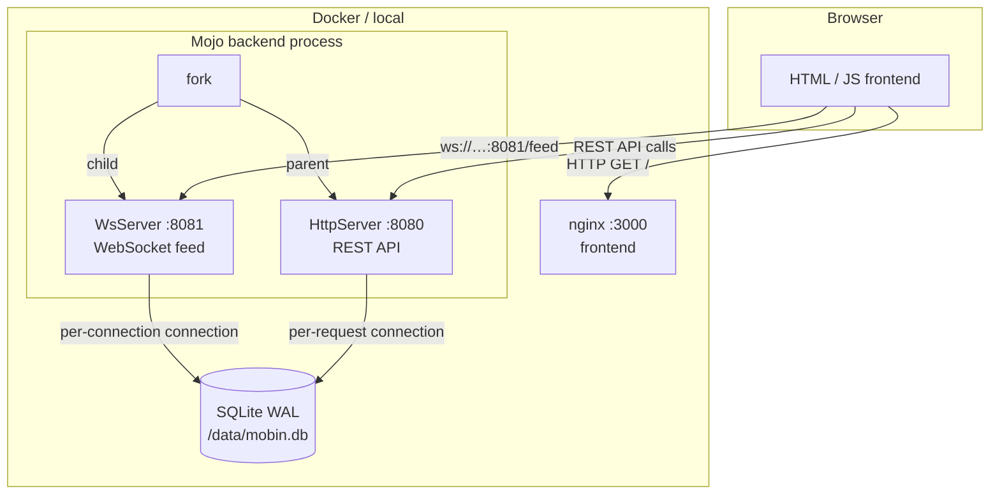

# mobin

A pastebin service built entirely in [Mojo](https://docs.modular.com/mojo/). Zero Python in the hot path — the HTTP server, WebSocket server, database layer, JSON serialisation, and routing are all Mojo code.

- **Backend**: Mojo (`flare` HTTP + WS, `sqlite`, `morph` JSON, `uuid`, `tempo`)
- **Frontend**: Vanilla JS + nginx — syntax highlighting, live feed via WebSocket
- **Infra**: Docker Compose, `pixi` dependency management

---

## Architecture



### Process model

`main()` calls `fork()` **once** before binding either port:

| Process | Role | Port |
|---------|------|------|
| Parent | `HttpServer` — handles all REST requests | `$PORT` (default 8080) |
| Child  | `WsServer` — pushes new pastes to subscribers | `$WS_PORT` (default 8081) |

`fork()` is used instead of `parallelize` because `parallelize`'s `TaskGroup` calls `abort()` on any unhandled exception — a routine WebSocket disconnection would kill both servers. Separate OS processes give full fault isolation: an EPIPE in the WS child does not affect the HTTP parent.

### Database

Both processes open **independent** SQLite connections. WAL mode allows one writer and many concurrent readers without blocking.

```
PRAGMA journal_mode = WAL;
PRAGMA synchronous  = NORMAL;
```

Each HTTP request and each WS connection gets its own `Database` handle that is closed when the handler returns (RAII).

### Mojo package layout

```
backend/
├── main.mojo               ← entry point (fork, bind, serve)
├── mobin/
│   ├── __init__.mojo       ← public re-exports
│   ├── models.mojo         ← Paste, PasteStats, ServerConfig structs
│   ├── db.mojo             ← SQLite helpers (init_db, db_create, …)
│   ├── handlers.mojo       ← per-route handler functions
│   ├── router.mojo         ← URL dispatch (method × path → handler)
│   ├── feed.mojo           ← WebSocket live-feed loop
│   └── static.mojo         ← embedded frontend HTML
└── tests/
    ├── test_models.mojo
    ├── test_db.mojo
    └── test_router.mojo
```

---

## Quick start — local

```bash
cd backend
pixi install          # resolve + install all Mojo dependencies
pixi run build        # compile main.mojo → ./mobin-backend
./mobin-backend       # start on :8080 (HTTP) and :8081 (WS)
```

Open `http://localhost:8080`.

Environment variables (all optional):

| Variable | Default | Description |
|----------|---------|-------------|
| `PORT` | `8080` | HTTP server port |
| `WS_PORT` | `8081` | WebSocket server port |
| `DB_PATH` | `data/mobin.db` | SQLite database file path |
| `FLARE_LIB` | *(auto)* | Explicit path to `libflare_tls.so` / `.dylib` |

---

## Quick start — Docker Compose

```bash
docker compose up --build
```

| URL | Service |
|-----|---------|
| `http://localhost:3000` | Frontend (nginx) |
| `http://localhost:8080` | Backend REST API (direct) |
| `http://localhost:8081` | WebSocket feed (direct) |
| `http://localhost:8089` | Locust load-test UI |

---

## Backend commands (`cd backend`)

| Command | What it does |
|---------|-------------|
| `pixi install` | Install all Mojo library dependencies into `.pixi/envs/default/` |
| `pixi run build` | Compile `main.mojo` to a standalone `mobin-backend` binary |
| `pixi run run` | Build then immediately start the backend |
| `pixi run run-dev` | Run with `mojo run` (no compile step, faster iteration) |
| `pixi run tests` | Run all three unit-test suites (`test_models`, `test_db`, `test_router`) |
| `pixi run test-models` | Unit tests for `Paste` / `PasteStats` / `ServerConfig` / `new_paste()` |
| `pixi run test-db` | Unit tests for all SQLite helpers (`init_db`, CRUD, stats, expiry) |
| `pixi run test-router` | Unit tests for URL routing, CORS preflight, 404 handling |
| `pixi run format` | Auto-format `mobin/`, `main.mojo`, and `tests/` with `mojo format` |

---

## Integration tests (`cd integtest`)

The integration suite starts a **real backend subprocess** with a temporary SQLite database, waits for `/health` to respond, runs all tests, then terminates the backend and its forked child.

| Command | What it does |
|---------|-------------|
| `pixi install` | Install Python test dependencies (`pytest`, `httpx`, `websockets`, `locust`) |
| `pixi run test` | Run HTTP + WebSocket integration tests against a freshly started backend |
| `pixi run test-all` | Same as above but includes any additional test files |
| `pixi run load-test` | Headless Locust: 50 users, 5/s ramp, 60 s, against `http://localhost:8080` |
| `pixi run load-ui` | Locust with web UI on `:8089` — set users and run time interactively |

Set `MOBIN_URL=http://my-server:8080` to run the test suite against an already-running instance instead of spawning a local backend.

---

## REST API

| Method | Path | Description |
|--------|------|-------------|
| `POST` | `/paste` | Create a new paste |
| `GET` | `/paste/{id}` | Fetch paste by UUID (increments view count) |
| `DELETE` | `/paste/{id}` | Delete paste by UUID |
| `GET` | `/pastes` | List pastes (`?limit=20&offset=0`) |
| `GET` | `/stats` | Global stats (`total`, `today`, `total_views`) |
| `GET` | `/health` | Liveness probe — returns `{"status":"ok"}` |
| `GET` | `/` | Serve frontend HTML |
| `OPTIONS` | `*` | CORS preflight — returns 204 with `Access-Control-Allow-*` headers |

All responses include `Access-Control-Allow-Origin: *`.

### Create paste

```bash
curl -X POST http://localhost:8080/paste \
  -H 'Content-Type: application/json' \
  -d '{
    "title":    "hello world",
    "content":  "print(\"hello\")",
    "language": "python",
    "ttl_days": 7
  }'
```

Response:

```json
{
  "id":         "550e8400-e29b-41d4-a716-446655440000",
  "title":      "hello world",
  "content":    "print(\"hello\")",
  "language":   "python",
  "created_at": 1712620800,
  "expires_at": 1713225600,
  "views":      0
}
```

### WebSocket live feed

```
ws://localhost:8081/feed
```

On connection the server begins polling the database every 500 ms. Each new paste is pushed as a JSON object (same schema as the REST response). A `PING` frame is sent after each poll to detect stale connections — the server silently drops disconnected clients and accepts the next one.

```bash
# Quick test with websocat
websocat ws://localhost:8081/feed
```

---

## Performance

| Metric | Estimate |
|--------|----------|
| HTTP RPS (SQLite read) | 800–1500 |
| SQLite WAL writes/s | 3 000–5 000 |
| SQLite WAL reads/s | 10 000+ |
| Idle memory | ~15 MB |

---

## Deployment

### Fly.io (free tier)

```bash
cd backend
fly launch --no-deploy
fly volumes create mobin_data --size 1
fly deploy
```

### Hetzner CX11 (~2 €/month)

```bash
# On the server
docker compose -f docker-compose.prod.yml up -d
```
