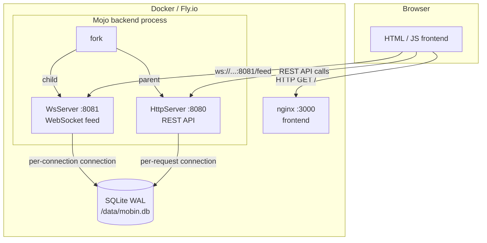

# Architecture



## Production URL routing (Fly.io)

In production (HTTPS), the frontend detects the protocol and adjusts:

- **API** -> same origin (`https://mobin.fly.dev/...`). Fly.io's `[http_service]` routes port 443 to internal port 8080
- **WebSocket** -> `wss://mobin.fly.dev:8081/feed`. Fly.io's `[[services]]` terminates TLS on port 8081 via a dedicated IPv4
- **Fallback** -> if WS is unreachable, the frontend polls `GET /pastes` every 3 seconds

In local dev, explicit ports are used: `:8080` for API, `:8081` for WS.

## Process model

`main()` calls `fork()` **once** before binding either port:

| Process | Role | Port |
|---------|------|------|
| Parent | `HttpServer`: handles all REST requests | `$PORT` (default 8080) |
| Child  | `WsServer`: pushes new pastes to subscribers | `$WS_PORT` (default 8081) |

`fork()` is used instead of `parallelize` because `parallelize`'s `TaskGroup` calls `abort()` on any unhandled exception, so a routine WebSocket disconnection would kill both servers. Separate OS processes give full fault isolation: an EPIPE in the WS child does not affect the HTTP parent. The WS child also self-restarts up to 10 times with exponential back-off before giving up.

## Database

Both processes open **independent** SQLite connections. WAL mode allows one writer and many concurrent readers without blocking.

```sql
PRAGMA journal_mode = WAL;
PRAGMA synchronous  = NORMAL;
```

Each HTTP request and each WS connection gets its own `Database` handle that is closed when the handler returns (RAII).

### Stats table

Stats use a dedicated `stats` table with monotonically-increasing counters:

| Counter | Incremented when | Never decreases |
|---------|-----------------|----------------|
| `total_pastes` | A paste is created | Even after paste expires or is purged |
| `total_views` | A paste is viewed | Even after paste expires or is purged |

The `today` counter resets to 0 at midnight UTC and counts up from there. All counters are stored in the `stats` table and survive paste expiry and purge. A backfill migration seeds counters from existing data when upgrading from an older schema.
